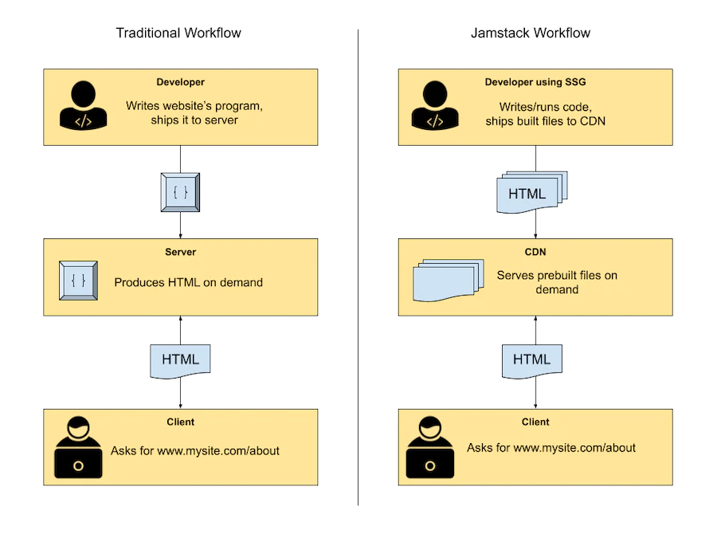

# Jamstack ([Source](https://snipcart.com/blog/jamstack))

The Jamstack is an architecture where a website is delivered statically, such as serving HTML from static hosting or CDN (content delivery network), but providing dynamic content and an interactive experience through JavaScript. The term itself represents the JAM in a website: JavaScript, APIs, and Markup.

## Jackstack vs Legacystack

### What is a CDN?

- A content delivery network (CDN) is a network of interconnected servers that speeds up webpage loading for data-heavy applications
- Examples : Amazon CloudFront, Google Cloud CDN, Azure CDN, Cloudflare

### What is a SSG? ([Source](https://snipcart.com/blog/choose-best-static-site-generator#the-best-static-site-generators-in-2022))

- SSG - Static Site Generators ([Click here for a list of SSGs](https://staticsitegenerators.net/))
- A static website generator is a simple markup that uses a language like Markdown or HTML, data (in JSON, YAML, or TOML format), and templates.
- This is similar to any dynamic web programming language like PHP, for example, but the key difference is that this is done at build time rather than on the server in response to each page request. This is why we call them static site generators since the assets they create (i.e., the ones we will deploy) are all static.
- If speed and reliability are your primary concerns, you should use a static site generator. However, if you’re building a highly dynamic website that needs to display almost real-time updates, then a static website is probably not your best option.
- Examples : Next.js, Nuxt.js, Gatsby, Eleventy, Hugo, Jekyll
