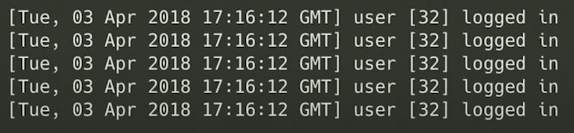

# Logging in JavaScript

- Log4j
- Syslog Standard
- Count.ly
- Logstash
- console.\*

## 4 Dimensions of Good Logs

- Context
  - Whats going on in the app
  - Whats the data
  - Whats the time
- Purpose
  - Is it for debugging?
  - Is it for analytics? (Improving UX)
  - Is it for auditing?
- Importance
  - Is someone about to die?
  - Is someone about to lose a million dollars?
  - Was there a garbage collection of it?
- Format
  - Is it human readable?
  - Is it `grep`able
  - Scannable
  - Parsable

## Context

#### Bad Context

#### Good Context

Here we got the same user logged in 5 times within one second. Either we got a bug or a bot. 
If you log the ip address, you can look into it

## Formatting

#### Bad Format

#### Good Format

## Good Practices

- Wrapping things in square brackets
- Instead of doing `console.log("Text", error.message)`, just log the actual error and not append it to a string. That will display the whole stacktrace
- Anyway it all depends on the goal

## The Logging Type Table

| Name     | Goal                       | Question             | Content                              | Audience                   |
| -------- | -------------------------- | -------------------- | ------------------------------------ | -------------------------- |
| Tracing  | Debugging                  | How did we get here? | State changes                        | Devs                       |
| Event    | Analytics                  | What's happening?    | Actions & exceptions                 | Admins/Product Owners/Devs |
| Progress | UX                         | RUOK?                | Precentage/Errors                    | Users                      |
| Audit    | Verification (of behavior) | RU Lying?            | Summaries, Double-entry book keeping | Compliance, Gov, Business  |

## Logging Golden Rules

- Remember the reader
- No personal data
- Answer the question

## Log Tools

- DataDog
- Loggly
- Splunk
